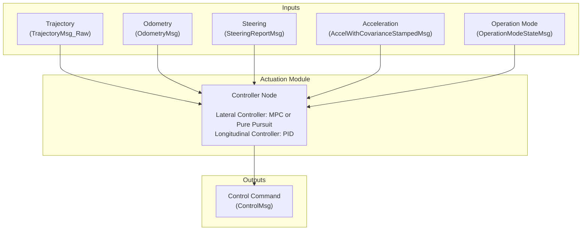

<!--
# Copyright (c) 2024-2025, Arm Limited.
#
# SPDX-License-Identifier: Apache-2.0
-->

# Autoware Trajectory Follower - Safety Island

## Components

| Component | Version |
|--------------|---------------|
| Zephyr RTOS  | [3.6.0](https://github.com/zephyrproject-rtos/zephyr/commit/6aeb7a2b96c2b212a34f00c0ad3862ac19e826e8) |
| CycloneDDS  | [0.11.x](https://github.com/eclipse-cyclonedds/cyclonedds/commit/7c253ad3c4461b10dc4cac36a257b097802cd043) |
| Autoware    | [2025.02](https://github.com/autowarefoundation/autoware/tree/2025.02) |
| Autoware.Universe | [0.40.0](https://github.com/autowarefoundation/autoware.universe/tree/0.40.0) |
| Autoware.msgs | [1.3.0](https://github.com/autowarefoundation/autoware_msgs/tree/1.3.0) |

## Workflow

## Autoware Node Dependencies

| Component | Status |
|-----------|---------|
| autoware_msgs | ✅ Completed |
| autoware_osqp_interface | ✅ Completed |
| autoware_universe_utils | ✅ Completed |
| autoware_motion_utils | ✅ Completed |
| autoware_interpolation | ✅ Completed |
| autoware_vehicle_info_utils | ✅ Completed |
| autoware_trajectory_follower_base | ✅ Completed |
| autoware_mpc_lateral_controller | ✅ Completed |
| autoware_pid_longitudinal_controller | ✅ Completed |
| autoware_trajectory_follower_node | ✅ Completed |

## ROS Utils Migration

| ROS Component | Zephyr Target | Status |
|--------------|---------------|---------|
| RCL Logging  | Custom Logger | ✅ Completed |
| RCL Node     | POSIX Threads | ✅ Completed |
| RCL Timers   | Software Timers | ✅ Completed |
| RCL Publisher | CycloneDDS | ✅ Completed |
| RCL Subscriber | CycloneDDS | ✅ Completed |
